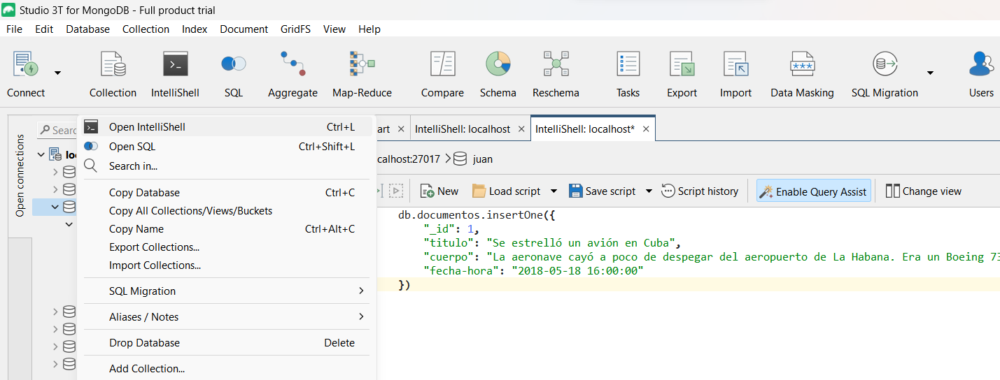

# Guía LABORATORIO: Introducción a Bases de Datos NOSQL

## Creación de "esquemas" con MongoDB con Studio 3T

A continuación se presentan algunas operaciones básicas de gestión de Bases de Datos con MongoDB a través de la interfaz Robo3T.

### Crear una db. 
Con botón derecho sobre la conexión, __Add Database__


## OPERACIONES CRUD

Si bien existen funcionalidades gráficas para ejecutar las operaciones CRUD, para aprender a gestionar este tipo de Bases de datos vamos a utilizar el Shell que provee la herramienta, al cual accedemos presionando el botón derecho sobre la Base de Datos que queremos operar y seleccionando `Open IntelliShell`, como se ve en la siguiente imagen:



Como vimos en la teoría, las operaciones de creación, actualización, borrado y consulta de datos son denominadas CRUD (create, read, update, delete) y son similares a las que estamos acostumbrados en los Sistemas Gestores de Bases de Datos tradicionales.

Ejemplo: cómo armar un documento JSON para importar a la base.

```javascript
    { 
        "_id": 1,
        "titulo": "Se estrelló un avión en Cuba",
        "cuerpo": "La aeronave cayó a poco de despegar del aeropuerto de La Habana. Era un Boeing 737 de una compañía aérea subsidiaria de Cubana de Aviación. El presidente cubano Miguel Díaz-Canel se dirigió de inmediato al lugar del accidente.",
        "fecha-hora": "2018-05-18 16:00:00"
    }
```

a) Incorporar un documento desde el shell

```javascript
    db.documentos.insertOne({ 
        "_id": 1,
        "titulo": "Se estrelló un avión en Cuba",
        "cuerpo": "La aeronave cayó a poco de despegar del aeropuerto de La Habana. Era un Boeing 737 de una compañía aérea subsidiaria de Cubana de Aviación. El presidente cubano Miguel Díaz-Canel se dirigió de inmediato al lugar del accidente.",
        "fecha-hora": "2018-05-18 16:00:00"
    })
```    

b) Buscar todos los documentos cargados en la colección.
```javascript
    db.documentos.find({})
```

c) Actualizar un atributo con __update__

```javascript
    db.documentos.update(
        {"_id": 1},
        {$set: {"titulo": "NOTICIA MODIFICADA EN UNLu"}}
    )
```

d) Eliminar un documento de la colección

```javascript
    db.documentos.deleteOne({"_id": 3})
```
    
e) Incorporar varios documentos a través del shell

Con la instrucción db.<mi colección>.insert([{doc1}, {doc2}, ...,])

Ejemplo:

```javascript
    db.documentos.insert(
    [
        
    {
        "_id" : ObjectId("5af98a285987f909b4005ff3"),
        "status_id" : "996013967498776577",
        "created_at" : ISODate("2018-05-14T13:06:49.000Z"),
        "user_id" : "213888080",
        "screen_name" : "Florsube",
        "text" : "@perroscalle  piel de gallina imaginando la situación de Alejandro!cada uno con sus montruos, jajaja, y nosotros preocupados por el dólar y la inflación! tiburón, qué buscas en la orilla?",
        "source" : "Twitter Web Client",
        "reply_to_user_id" : "76727519",
        "reply_to_screen_name" : "perroscalle",
        "is_quote" : false,
        "is_retweet" : false,
```

d) Utilizar operadores de comparación

¿Cuantos tweets tienen más de un retweet?

```javascript

db.getCollection('tweets').find({retweet_count: {$gt: 1} })

```
Además, podemos consultar otros operadores de MongoDB [aquí](https://docs.mongodb.com/manual/reference/operator/query-comparison/)

e) Utilizar búsquedas por cadenas

¿Cuáles usuarios comienzan con P?

```javascript

db.getCollection('tweets').find({screen_name: {$regex: "^P.*"} })
```

## Importación de Datos con MongoImport

La herramienta _mongoimport_ es una herramienta de MongoDB que permite importar a una DB Mongo contenido de una exportación JSON, CSV o TSV creada por mongoexport, o potencialmente, otra herramienta de exportación de terceros.

La forma de utilización es mediante el comando _mongoimport_ es la siguiente desde una consola:

Sistemas Operativos UNIX:
```javascript

$ mongoimport --host localhost --port 27017 --username user --password "pass" --collection tweets --db dolar --file /home/juan/Escritorio/dolar.json

```

Sistemas Operativos Windows:
```javascript

> mongoimport --host localhost --port 27017 --collection tweets --db dolar --file C:\Users\unlu\dolar.json

```
