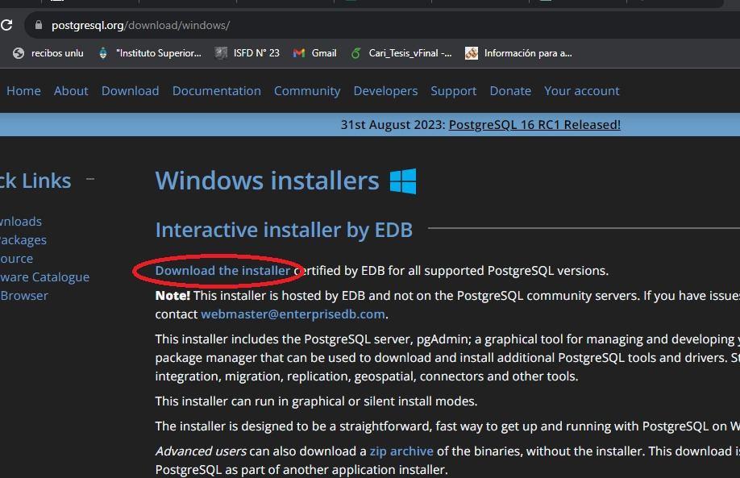
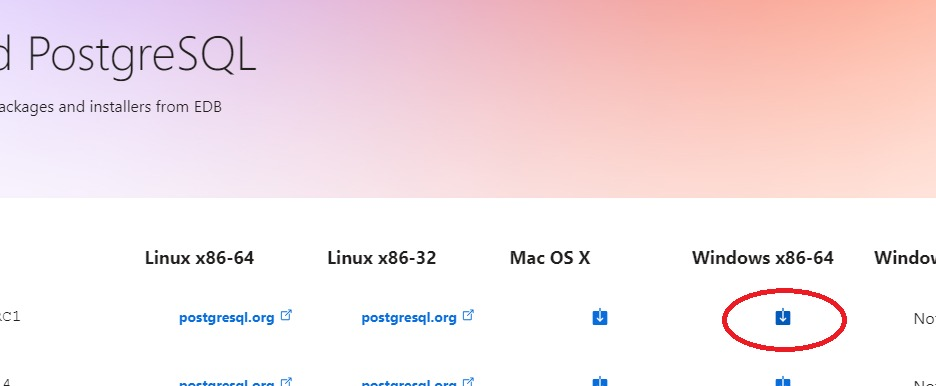
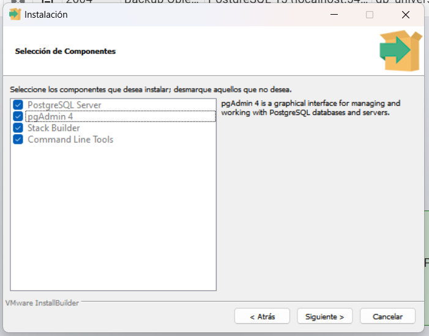

# Guía de Instalación de PostgreSQL + pgAdmin

PostgreSQL es un sistema de gestión de bases de datos relacional (RDBMS, por sus siglas en inglés) de código abierto y de alto rendimiento. Fue desarrollado originalmente en la Universidad de California en Berkeley a principios de la década de 1990 y ha ido ganando popularidad desde entonces.

<p align="center">

</p>

A continuación se enumeran algunas de las principales características de PostgreSQL:
1. __Open Source:__ Es software libre, lo cual significa que su código fuente está disponible para que cualquiera lo examine, modifique y distribuya de acuerdo con los términos de su licencia (Licencia PostgreSQL, que es similar a la Licencia MIT).
2. __Bases de datos relacionales:__ Está dentro de las DB que siguen el modelo de bases de datos relacionales, lo que significa que organiza los datos en tablas con relaciones definidas entre ellas.
3. __Extensibilidad:__ Es altamente extensible y permite a los desarrolladores crear sus propias funciones, tipos de datos y lenguajes de programación para extender su funcionalidad.
4. __Transacciones y ACID:__ Garantiza la integridad de los datos mediante el soporte de transacciones ACID (Atomicidad, Consistencia, Aislamiento, Durabilidad), lo que significa que las operaciones de base de datos se ejecutan de manera segura y confiable.
5. __Escalabilidad:__ Es conocido por su capacidad para manejar grandes cantidades de datos y cargas de trabajo intensivas. Se puede configurar para escalar horizontal o verticalmente según las necesidades de rendimiento.
6. __Compatibilidad con múltiples plataformas:__ Es compatible con todas las familias de sistemas operativos tales cómo Linux, Windows, macOS y más. Además, cuenta con numerosas bibliotecas y controladores que facilitan la integración con una variedad de lenguajes de programación y aplicaciones.

## Instalación paso a paso de PostgreSQL + pgAdmin

<p align="center">

</p>

> **¿Qué versión instalar?** Se recomienda **PostgreSQL 18**, la última versión estable (con soporte hasta noviembre de 2030). Cualquier versión con soporte vigente, desde la 16 en adelante, sirve para el curso. En Windows y macOS, pgAdmin se instala junto con PostgreSQL; en Linux se instala por separado.

### Sistemas Operativos Windows:
1. La instalación de PostgreSQL en SO Windows es una instalación muy sencilla. En primer lugar, se debe acceder al Sitio Web Oficial de PostgreSQL en https://www.postgresql.org/download/windows/ y hacer clic en **Download the installer** (instalador interactivo de EDB, que incluye pgAdmin).

<p align="center">

</p>

2. En la página de descargas, se debe seleccionar la versión de PostgreSQL que se desea instalar (**se recomienda la versión 18**) para Windows x86-64. Una vez elegida, hacer clic en el enlace correspondiente para descargar el instalador de Windows.

<p align="center">

</p>

3. Una vez que se haya completado la descarga, se debe ejecutar el archivo de instalación descargado. En ese momento aparecerá un asistente de instalación. Haz clic en "Siguiente" para continuar.
4. En la pantalla siguiente pueden escogerse los componentes adicionales que se pueden instalar, aquí optaremos seleccionar **pgAdmin** también.

<p align="center">

</p>

5. A continuación se debe seleccionar la ubicación donde se desea instalar PostgreSQL (la ubicación predeterminada es adecuada para la mayoría de los casos). Luego, haz clic en "Siguiente".
6. En la siguiente pantalla, se deben seleccionar los componentes que deseas instalar. A menos que tengas conocimientos o necesidades específicos, se recomienda dejar las opciones predeterminadas seleccionadas (PostgreSQL Server, pgAdmin 4 y Command Line Tools). Haz clic en "Siguiente".
7. Luego, se elegirá el directorio donde se almacenarán los datos que se generan a partir de la gestión de las Bases de Datos. A menos que tengas conocimientos o necesidades específicos, se recomienda dejar las opciones predeterminadas seleccionadas. Haz clic en "Siguiente".
8. A continuación, se debe establecer una contraseña para el usuario "postgres", que es el superusuario de PostgreSQL. Asegúrate de recordar esta contraseña, ya que la necesitarás más adelante.
9. En la siguiente pantalla, elige el puerto en el que PostgreSQL escuchará las conexiones. El valor predeterminado es 5432, pero puedes cambiarlo si lo deseas aunque es recomendable dejar el puerto por defecto en la mayoría de los casos.
10. En la siguiente pantalla, puedes elegir el idioma y la contribución regional para la instalación. Deja las opciones predeterminadas a menos que necesites configurarlas de manera diferente.
11. El asistente de instalación mostrará un resumen de las configuraciones que has seleccionado. Revisa la información y, si todo parece correcto, haz clic en "Siguiente" para comenzar la instalación. El instalador copiará los archivos y configurará PostgreSQL. Este proceso puede llevar varios minutos.
12. Una vez que la instalación se complete con éxito, verás una pantalla que indica que la instalación fue exitosa. Haz clic en "Finalizar" para cerrar el instalador. Si se ofrece ejecutar **Stack Builder**, no es necesario para el curso: puedes destildar la opción.
13. Para verificar que PostgreSQL se ha instalado correctamente, es posible abrir **SQL Shell (psql)** desde el menú Inicio (carpeta PostgreSQL 18) o la consola de comandos (cmd) y ejecutar el siguiente comando para acceder a la consola de comandos de PostgreSQL (psql):
```
psql -U postgres
```
14. La respuesta debería ser la solicitud de ingreso de la contraseña que configuraste para el usuario "postgres". Después de ingresarla correctamente, deberías poder acceder a la línea de comandos de PostgreSQL. Si la consola indica que `psql` no se reconoce como comando, usa directamente **SQL Shell (psql)** desde el menú Inicio.

### Sistemas operativos macOS:
1. Desde https://www.postgresql.org/download/macosx/ se puede descargar el mismo instalador interactivo de EDB que en Windows (**Download the installer**), que incluye PostgreSQL y pgAdmin. Elige la versión 18 para macOS.
2. Abre el archivo `.dmg` descargado y ejecuta el instalador. Los pasos son los mismos que en Windows (pasos 3 a 12): deja seleccionados PostgreSQL Server, pgAdmin 4 y Command Line Tools, mantén las ubicaciones por defecto, define la contraseña del usuario "postgres" y deja el puerto 5432.
3. Para verificar la instalación, abre **pgAdmin 4** desde Aplicaciones (carpeta PostgreSQL 18), despliega **Servers** e ingresa la contraseña definida durante la instalación. En la misma carpeta se instala **SQL Shell (psql)**, la consola de comandos de PostgreSQL.
4. Como alternativa, [Postgres.app](https://postgresapp.com/) es una forma muy simple de ejecutar PostgreSQL en macOS. En ese caso, pgAdmin se descarga por separado desde https://www.pgadmin.org/download/pgadmin-4-macos/.

### Sistemas operativos Linux (Ubuntu):
1. Abre una terminal e instala PostgreSQL y el paquete adicional `postgresql-contrib`, que incluye extensiones útiles. Con estos comandos se instala la versión de PostgreSQL incluida en tu versión de Ubuntu:
```
sudo apt update
sudo apt install postgresql postgresql-contrib
```
2. La instalación crea el usuario "postgres", que es el superusuario de PostgreSQL, y no solicita una contraseña. Para acceder a la línea de comandos de PostgreSQL (psql) con ese usuario, utiliza el siguiente comando:
```
sudo -u postgres psql
```
3. Dentro de psql, define una contraseña para el usuario "postgres" (la necesitarás para conectarte desde pgAdmin):
```
\password postgres
```
4. Una vez terminadas las tareas con PostgreSQL, sal de psql con el comando `\q`.
5. pgAdmin no está incluido en los repositorios de Ubuntu, por lo que primero hay que agregar el repositorio oficial de pgAdmin y luego instalarlo:
```
curl -fsS https://www.pgadmin.org/static/packages_pgadmin_org.pub | sudo gpg --dearmor -o /etc/apt/keyrings/packages-pgadmin-org.gpg
sudo sh -c 'echo "deb [signed-by=/etc/apt/keyrings/packages-pgadmin-org.gpg] https://ftp.postgresql.org/pub/pgadmin/pgadmin4/apt/$(lsb_release -cs) pgadmin4 main" > /etc/apt/sources.list.d/pgadmin4.list && apt update'
sudo apt install pgadmin4-desktop
```
6. Abre pgAdmin 4 y registra el servidor local (clic derecho en **Servers** > **Register** > **Server...**). En la pestaña *General* asígnale un nombre (por ejemplo, "Local") y en la pestaña *Connection* completa Host `localhost`, puerto `5432`, usuario `postgres` y la contraseña definida en el paso 3.
7. Si prefieres instalar la última versión de PostgreSQL en lugar de la incluida en Ubuntu, puedes agregar el repositorio oficial de PostgreSQL antes del paso 1:
```
sudo apt install -y postgresql-common
sudo /usr/share/postgresql-common/pgdg/apt.postgresql.org.sh
sudo apt install postgresql-18 postgresql-contrib
```
8. Ahora sí, hemos terminado.

_Última actualización: octubre de 2026._
