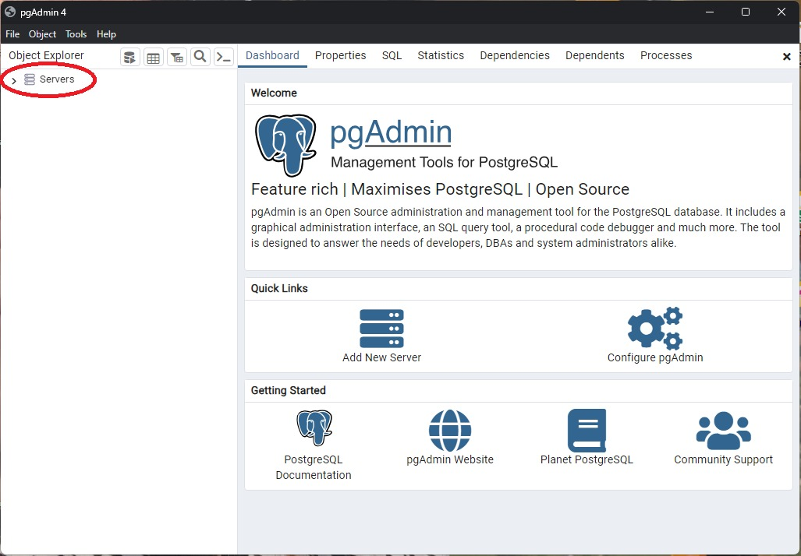
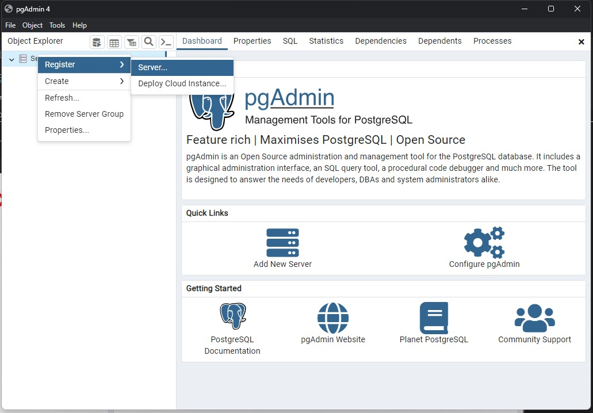
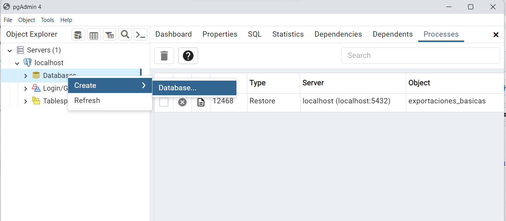
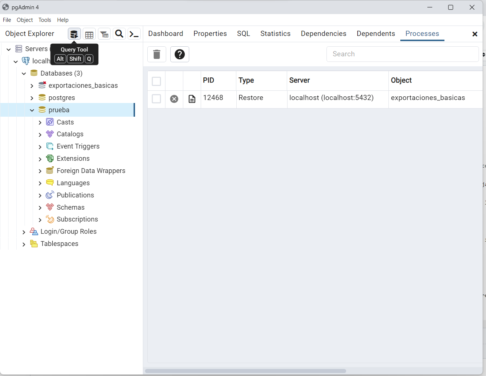

# Introducción a la gestión de PostgreSQL desde pgAdmin

La forma tradicional de administración de una DB es mediante la consola del Sistema Operativo, sin embargo, existen herramientas gráficas de administración de bases de datos que brindan diversas utilidades y propenden a una administración más sencilla.
La herramienta de administración más utilizada para PostgreSQL es **pgAdmin**. pgAdmin provee una interfaz gráfica intuitiva que permite la ejecución tanto de los comandos DDL como los DML de forma gráfica, brindando un gestor de consultas, generador de backups, generador de diagramas DER, etc.

## Configuración inicial del servidor PostgreSQL en pgAdmin
Cuando recién instalamos pgAmin, lo primero que debemos hacer, para poder administrar PostgreSQL desde la aplicación es configurar el acceso de pgAdmin al Servidor de Bases de Datos de PostgreSQL.
A continuación, se realiza un paso a paso de esta configuración:
1. Cuando iniciamos pgAdmin, ir al ícono *Server*, presionar botón derecho sobre el y elegir la opción *Register > Server...*.

2. Aquí vamos a configurar el acceso, para ello debemos determinar una serie de datos mínimos:
- *Name* en la pestaña *General*: Este nombre podrá ser cualquier nombre de su interés, por ejemplo: PC-local, lo cual indica que es una conexión local. Este campo admite cualquier nombre.
- *Host name/address* en la pestaña *Connection*: aquí debemos poner *localhost*.
- *Port* en la pestaña *Connection*: en caso que hayamos modificado el puerto de escucha de la DB, debemos escribirlo. De lo contrario dejamos el puerto por defecto (5432).
- *Password* en la pestaña *Connection*: Aquí escribimos la clave que elegimos al momento de instalar pgAdmin.
- *Save password?* en la pestaña *Connection*: Aquí podemos elegir que guarde la clave para no volver a ingresarla cada vez que iniciamos la conexión. Esto es recomendable sólo para instalaciones locales.

## Utilización básica de pgAdmin
Una vez que configuramos el acceso al Servidor de PostgreSQL desde pgAdmin podemos comenzar a trabajar con nuestras Bases de Datos.
1. En primer lugar, debemos crear una Base de Datos. Para crear la DB, debemos expandir el Servidor creado y hacer click derecho sobre el ícono *Databases* y elegir la opción *Create > Database*. Esta es la única sentencia DDL que no puede ejecutarse mediante instrucciones SQL desde pgAdmin dado que siempre debemos estar apuntando a una DB en particular.

2. Si bien es posible definir un sinfín de parámetros como el *encoding* y la configuración regional, con el sólo hecho de elegir un nombre ya podemos crearla. En nuestro caso, elegimos el nombre *prueba* para completar esta demostración.
3. Una vez que tenemos la Base de Datos creada, podemos ejecutar todas las instrucciones, tanto DDL como DML desde la herramienta *Query Tool*, la cual debemos ejecutar siempre parados sobre la Base de Datos sobre la cual vamos a ejecutar las instrucciones. Si en algún momento, vamos a pasar de una DB a otra, debemos tener en cuenta que la consola de *Querys* debe volver a abrirse desde la otra DB, lo cual se realiza haciendo foto con el mouse y presionando sobre la DB a adminsitrar.

